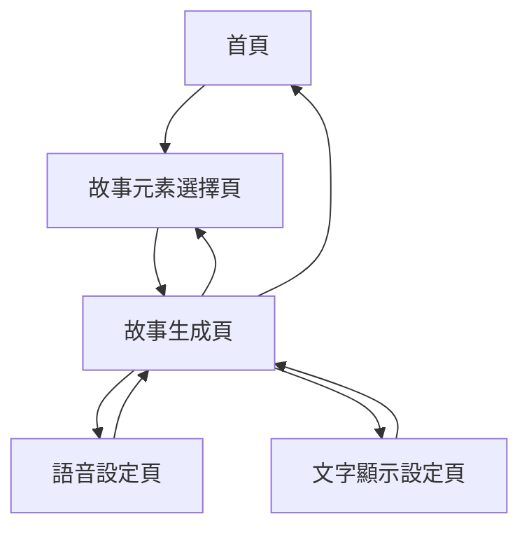

# 幼兒床邊故事館產品需求文檔

## 1. Product Overview
幼兒床邊故事館是一個專為5歲以下小朋友設計的互動式故事生成器網站，通過選擇不同的故事元素來生成適合幼兒的床邊故事。
- 提供豐富的故事元素選擇，讓家長和小朋友共同參與故事創作過程，增進親子互動。
- 結合語音朗讀功能和多語言輔助顯示，幫助幼兒語言學習和閱讀能力發展。

## 2. Core Features

### 2.1 User Roles
本產品採用單一用戶模式，無需註冊登入，所有用戶均可直接使用全部功能。

### 2.2 Feature Module
我們的幼兒床邊故事館包含以下主要頁面：
1. **首頁**：網站介紹、快速開始按鈕、最近生成的故事預覽
2. **故事元素選擇頁**：角色選擇、場景選擇、題材選擇、情節元素選擇
3. **故事生成頁**：顯示生成的故事內容、語音控制、文字顯示設定
4. **語音設定頁**：聲音選擇、語調調整、語速調整
5. **文字顯示設定頁**：字體大小調整、注音/拼音/英文顯示選項

### 2.3 Page Details

| Page Name | Module Name | Feature description |
|-----------|-------------|---------------------|
| 首頁 | 網站標題區 | 顯示「幼兒床邊故事館」標題，配有可愛插圖和歡迎文字 |
| 首頁 | 快速開始區 | 大型可愛「開始創作故事」按鈕，引導用戶進入故事創作流程 |
| 首頁 | 故事預覽區 | 展示最近生成的3個故事縮圖和標題，可點擊重新閱讀 |
| 故事元素選擇頁 | 角色選擇模組 | 提供12種可愛動物角色選擇：小兔子、小熊、小貓、小狗、小鳥、小魚、小象、小猴子、小豬、小羊、小鴨、小老鼠 |
| 故事元素選擇頁 | 場景選擇模組 | 提供8種場景選擇：森林、海邊、花園、城堡、農場、太空、彩虹橋、魔法森林 |
| 故事元素選擇頁 | 題材選擇模組 | 提供6種故事題材：友誼、勇氣、分享、幫助他人、探險、學習新技能 |
| 故事元素選擇頁 | 情節元素模組 | 提供4種情節元素：遇到困難、找到寶藏、結交新朋友、學會新本領 |
| 故事元素選擇頁 | 生成按鈕 | 大型可愛「生成我的故事」按鈕，收集所有選擇並生成故事 |
| 故事生成頁 | 故事顯示區 | 以大字體顯示生成的故事內容，支援滾動閱讀 |
| 故事生成頁 | 語音播放控制 | 播放/暫停按鈕、進度條、音量控制，使用ElevenLabs API進行語音合成 |
| 故事生成頁 | 文字輔助顯示 | 根據用戶設定在中文旁顯示注音、拼音或英文翻譯 |
| 故事生成頁 | 操作按鈕區 | 重新生成故事、分享故事、返回選擇頁面按鈕 |
| 語音設定頁 | 聲音選擇模組 | 提供6種不同聲音選項：溫柔女聲、活潑女聲、慈祥男聲、年輕男聲、童聲、機器人聲 |
| 語音設定頁 | 語調調整模組 | 滑桿控制語調高低，範圍從低沉到高亢 |
| 語音設定頁 | 語速調整模組 | 滑桿控制語速快慢，範圍從慢速到快速 |
| 語音設定頁 | 預覽播放 | 「試聽」按鈕播放示例文字以預覽語音效果 |
| 文字顯示設定頁 | 字體大小調整 | 滑桿控制字體大小，提供小、中、大、超大四個級別 |
| 文字顯示設定頁 | 輔助文字選擇 | 複選框選擇顯示注音、漢語拼音、英文翻譯的組合 |
| 文字顯示設定頁 | 預覽顯示 | 即時預覽文字顯示效果的示例區域 |

## 3. Core Process

用戶操作流程：
1. 用戶進入首頁，點擊「開始創作故事」按鈕
2. 進入故事元素選擇頁面，依序選擇角色、場景、題材和情節元素
3. 點擊「生成我的故事」按鈕，系統根據選擇的元素生成適合幼兒的故事
4. 進入故事生成頁面，顯示生成的故事內容
5. 用戶可以點擊語音播放按鈕聽故事，或調整文字顯示設定
6. 可以重新生成故事或返回重新選擇元素

## 4. User Interface Design

### 4.1 Design Style
- **主色調**：溫暖的淺藍色 (#87CEEB) 和柔和的粉紅色 (#FFB6C1)
- **輔助色**：淺黃色 (#FFFFE0)、淺綠色 (#98FB98)、淺紫色 (#DDA0DD)
- **按鈕樣式**：圓角矩形按鈕，帶有輕微陰影和漸變效果，hover時有放大動畫
- **字體**：中文使用微軟正黑體，英文使用Comic Sans MS，字體大小最小18px
- **佈局風格**：卡片式設計，大量留白，元素間距寬鬆，適合觸控操作
- **圖標風格**：使用可愛的卡通風格圖標和emoji，色彩豐富但不刺眼

### 4.2 Page Design Overview

| Page Name | Module Name | UI Elements |
|-----------|-------------|-------------|
| 首頁 | 網站標題區 | 大標題使用36px字體，配有彩虹色漸變效果，周圍有星星和雲朵裝飾 |
| 首頁 | 快速開始區 | 120px高的圓角按鈕，淺藍色背景，白色文字，帶有小火箭圖標 |
| 首頁 | 故事預覽區 | 3個並排的卡片，每個卡片150px高，圓角設計，淺色背景 |
| 故事元素選擇頁 | 角色選擇模組 | 4x3網格佈局，每個角色為100px正方形卡片，帶有動物插圖和名稱 |
| 故事元素選擇頁 | 場景選擇模組 | 2x4網格佈局，每個場景為150px寬卡片，帶有場景插圖 |
| 故事元素選擇頁 | 題材選擇模組 | 2x3網格佈局，每個題材為圓形按鈕，直徑80px，不同顏色 |
| 故事元素選擇頁 | 生成按鈕 | 頁面底部固定位置，全寬按鈕，60px高，綠色背景 |
| 故事生成頁 | 故事顯示區 | 白色背景卡片，內邊距30px，24px字體，行距1.8 |
| 故事生成頁 | 語音播放控制 | 底部固定工具欄，包含圓形播放按鈕和進度條 |
| 語音設定頁 | 聲音選擇模組 | 6個語音選項以卡片形式展示，每個卡片帶有聲音波形圖標 |
| 語音設定頁 | 調整滑桿 | 自定義樣式滑桿，軌道為淺灰色，滑塊為主色調 |
| 文字顯示設定頁 | 字體調整 | 四個字體大小示例按鈕，點擊切換 |
| 文字顯示設定頁 | 輔助文字選擇 | 大型複選框，每個選項配有示例文字 |

### 4.3 Responsiveness
本產品採用響應式設計，優先考慮平板和手機端體驗，支援觸控操作，所有按鈕和互動元素都針對觸控進行了優化。